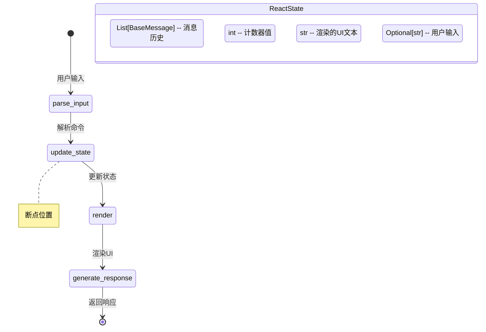
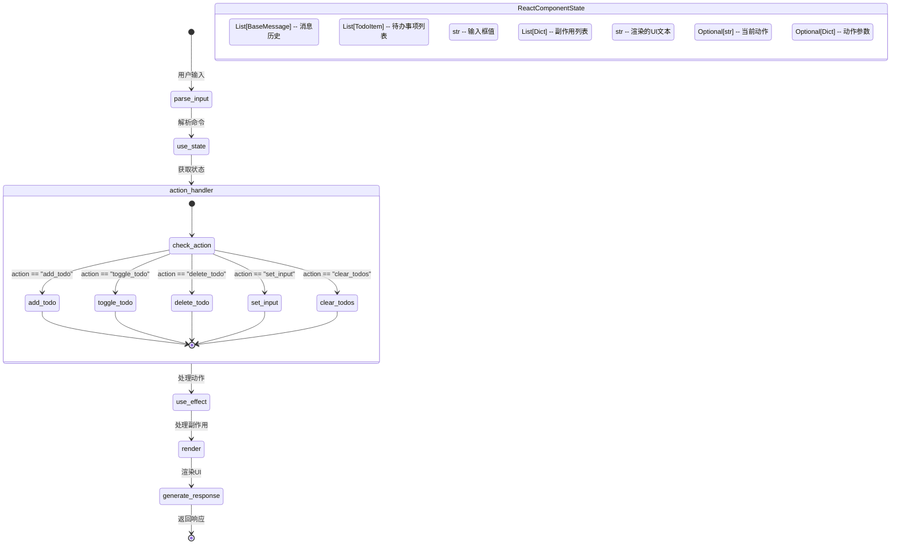
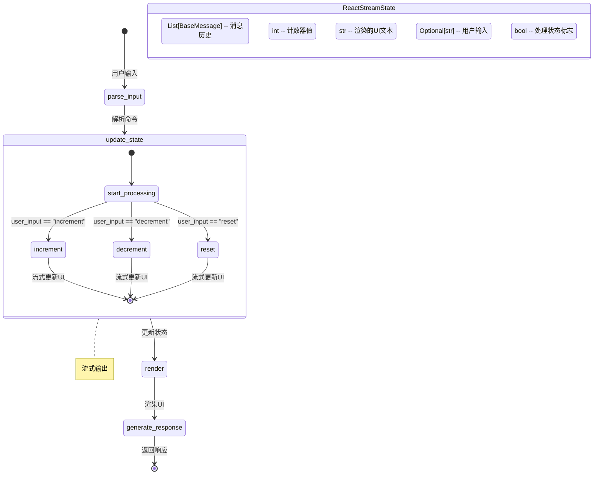
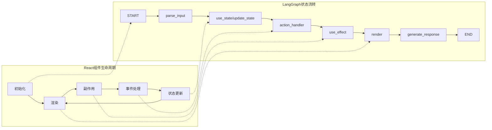
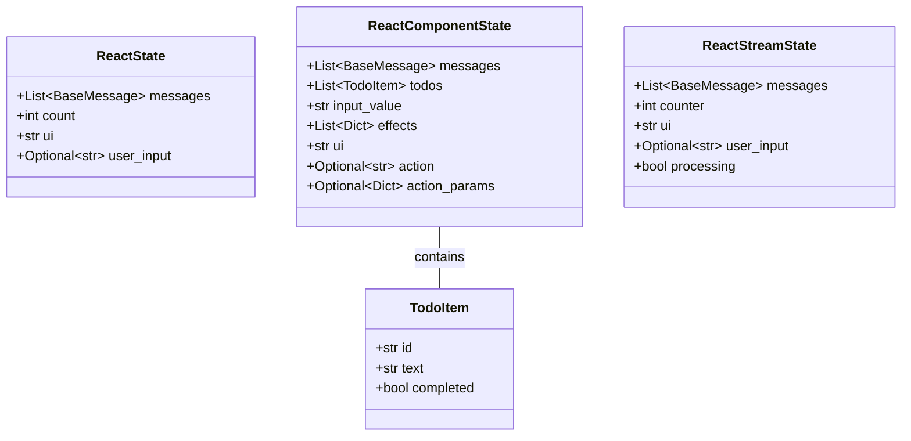
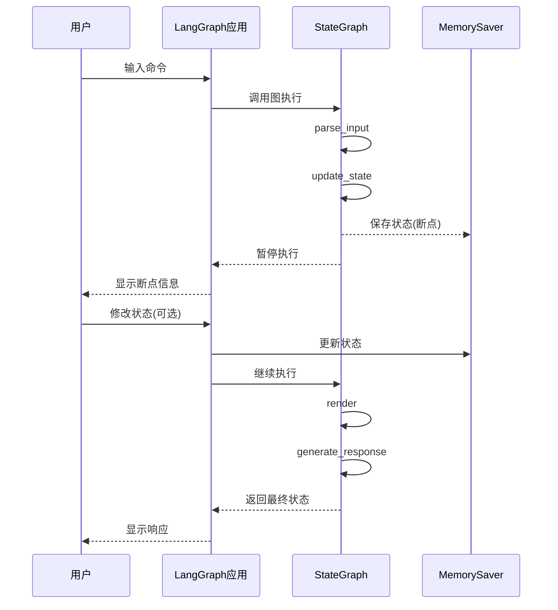
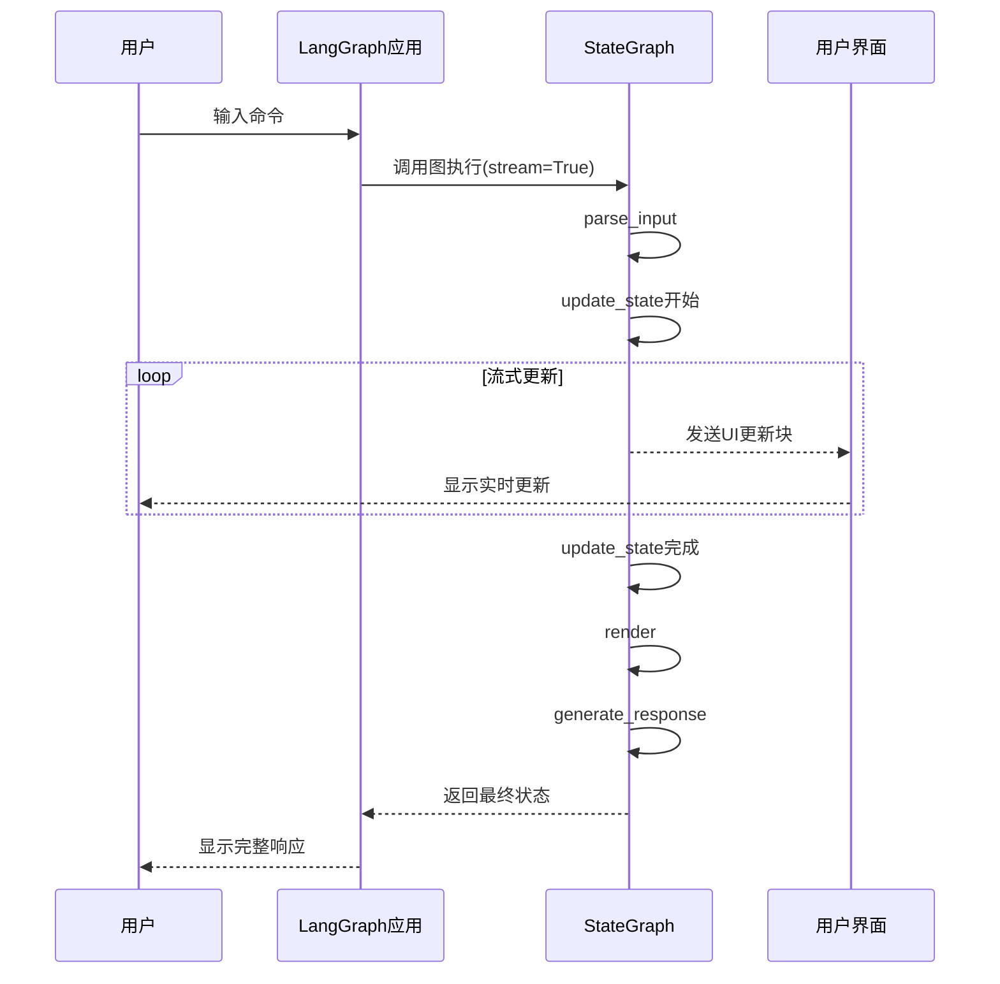

# LangGraph 学习项目

本项目是一个综合性的LangGraph学习资源，包含从基础到高级的学习示例、概念解析以及React风格的应用示例实现。

## 项目概述

LangGraph是基于LangChain的图执行框架，专为构建复杂AI工作流和智能体系统设计，支持循环、条件分支和状态管理。本项目内容按照难度递进组织，帮助你系统学习LangGraph核心概念及应用开发。

## 项目内容

### 核心文档

- **学习示例.md**: 按难度整理的代码示例列表，从简单对话到复杂智能体系统
- **langgraph概念理解.md**: 详细解析LangGraph核心概念，包含图示和代码示例

### 代码目录

- `learn/`: 学习代码目录，包含所有基础示例实现
- 根目录下的React风格应用示例

## 学习内容层次

### 基础篇: 理解核心概念
- 第一个LangGraph应用
- 状态设计详解
- 节点函数设计
- 图结构与流程控制
- 流式输出与事件监听

### 进阶篇: 实用功能实现
- 工具调用与外部集成
- 状态回放与历史追踪
- 多Agent协作系统
- 记忆与持久化
- 交互式UI集成

### 高级篇: 复杂应用与优化
- 决策与规划系统
- 自主代理系统
- 多模态处理
- 性能优化与扩展

### 实战项目:
- 智能客服系统
- 内容创作系统
- 专家系统实现

## LangGraph核心概念

本项目深入解析以下核心概念:

- **状态(State)**: 图执行过程中的数据容器
- **节点(Node)**: 图中的处理单元，接收状态并返回更新
- **边(Edge)**: 定义节点间连接和执行流
- **条件边(ConditionalEdge)**: 基于状态内容动态决定下一节点
- **状态图(StateGraph)**: 整个应用的蓝图，组织节点和边
- **工具调用(Tool Calling)**: LLM通过工具做出决策和执行动作
- **检查点器(Checkpointer)**: 管理图的状态持久化
- **断点(Breakpoint)和人机交互**: 暂停执行进行交互
- **时间旅行(Time Travel)**: 回到之前状态重新执行

## 智能方案实现

项目包含多种LLM应用模式的图结构实现:

- 思维链(Chain-of-Thought)
- 自我反思(Self-Reflection)
- 多智能体协作(Multi-Agent)
- 验证-修正循环(Verify-and-Correct)
- 树搜索决策(Tree Search)
- ReAct模式

## 建议学习路径

1. 完成基础篇1-5，掌握核心概念与基本流程
2. 学习流式输出与事件监听，了解实时交互功能
3. 学习状态回放与历史追踪，掌握调试技巧
4. 根据兴趣选择进阶篇中的2-3个示例深入学习
5. 尝试结合自己的需求实现一个小项目
6. 探索高级篇中的复杂功能
7. 挑战实战项目开发

## React风格应用示例

本项目还包含了如何使用LangGraph构建模拟React组件生命周期的应用程序示例。通过这些示例，您可以了解如何将React的核心概念（如状态管理、组件渲染和副作用处理）应用到LangGraph框架中。

### 示例项目结构

项目包含三个主要示例：

1. **基础计数器应用** (`react_langgraph_breakpoint.py`) - 带断点调试功能的简单计数器
2. **待办事项应用** (`react_langgraph_todo.py`) - 更复杂的待办事项管理器，展示了更完整的React模式
3. **流式计数器应用** (`react_langgraph_streaming.py`) - 展示了如何实现流式UI更新的计数器

### 核心概念图解

#### 基本状态流转图

所有示例都遵循类似的状态流转模式，模拟React的渲染循环：

#### 待办事项应用流程图

待办事项应用实现了更完整的React模式，包括副作用处理：

#### 流式处理应用流程图

流式处理应用展示了如何实现异步流式UI更新：

### React风格应用功能说明

#### 1. 基础计数器应用 (带断点)

这个应用实现了一个简单的计数器，并展示了LangGraph的断点功能：

- **功能**：增加、减少和重置计数器
- **特色**：在`update_state`节点后设置断点，允许用户在执行过程中检查和修改状态
- **状态结构**：
  - `messages`: 消息历史
  - `count`: 计数器值
  - `ui`: 渲染的UI文本
  - `user_input`: 用户输入

#### 2. 待办事项应用

这个应用实现了一个更复杂的待办事项管理器，展示了更完整的React模式：

- **功能**：添加、切换、删除和清空待办事项
- **特色**：实现了React的`useState`和`useEffect`钩子模式
- **状态结构**：
  - `messages`: 消息历史
  - `todos`: 待办事项列表
  - `input_value`: 输入框值
  - `effects`: 副作用列表
  - `ui`: 渲染的UI文本
  - `action`: 当前动作
  - `action_params`: 动作参数

#### 3. 流式计数器应用

这个应用展示了如何实现流式UI更新：

- **功能**：增加、减少和重置计数器，带有动画效果
- **特色**：使用异步迭代器实现流式UI更新，模拟处理过程中的状态变化
- **状态结构**：
  - `messages`: 消息历史
  - `counter`: 计数器值
  - `ui`: 渲染的UI文本
  - `user_input`: 用户输入
  - `processing`: 处理状态标志

### React模式在LangGraph中的应用

这些示例展示了如何在LangGraph中实现React的核心设计理念：

1. **状态隔离**：每个组件维护自己的状态，通过TypedDict定义状态结构

2. **单向数据流**：数据沿着图的边单向流动，从输入解析到状态更新，再到渲染和响应生成

3. **声明式UI**：UI是状态的函数，通过`render`函数将当前状态转换为UI表示

4. **副作用处理**：使用类似React的`useEffect`模式处理副作用，如日志记录和数据持久化

5. **组件生命周期**：通过图的节点和边模拟React组件的生命周期，从状态初始化到渲染和更新

## 适用场景

LangGraph特别适合以下场景:

- 智能体系统：需要LLM根据情况做出决策
- 多轮交互：需要维护上下文和状态的对话应用
- 工具使用：LLM需要调用外部工具解决问题
- 人机协作：需要人类审核和干预的关键决策
- 复杂流程：有条件分支和循环的应用
- 多智能体系统：多个LLM角色协作解决问题

## 学习资源

- LangGraph官方文档：[链接](https://python.langchain.com/docs/langgraph)
- LangGraph Quickstart：[链接](https://langchain-ai.github.io/langgraph/tutorials/introduction/)
- 示例代码库：[链接](https://github.com/langchain-ai/langgraph/tree/main/examples)
- LangSmith调试与监控：[链接](https://docs.smith.langchain.com)
- 社区讨论：[Discord](https://discord.com/invite/6adMQxSpJS)

## 如何使用本项目

1. 克隆此仓库到本地
2. 按照学习路径逐步学习示例代码
3. 参考概念理解文档深入理解LangGraph原理
4. 探索React风格应用示例，了解如何构建复杂交互应用
5. 尝试修改和扩展示例，构建自己的应用

# LangGraph React风格应用示例

本项目展示了如何使用LangGraph构建模拟React组件生命周期的应用程序。通过这些示例，您可以了解如何将React的核心概念（如状态管理、组件渲染和副作用处理）应用到LangGraph框架中。

## 项目结构

项目包含三个主要示例：

1. **基础计数器应用** (`react_langgraph_breakpoint.py`) - 带断点调试功能的简单计数器
2. **待办事项应用** (`react_langgraph_todo.py`) - 更复杂的待办事项管理器，展示了更完整的React模式
3. **流式计数器应用** (`react_langgraph_streaming.py`) - 展示了如何实现流式UI更新的计数器

## 核心概念图解

### 基本状态流转图

所有示例都遵循类似的状态流转模式，模拟React的渲染循环：

### 待办事项应用流程图

待办事项应用实现了更完整的React模式，包括副作用处理：

### 流式处理应用流程图

流式处理应用展示了如何实现异步流式UI更新：

## 功能说明

### 1. 基础计数器应用 (带断点)

这个应用实现了一个简单的计数器，并展示了LangGraph的断点功能：

- **功能**：增加、减少和重置计数器
- **特色**：在`update_state`节点后设置断点，允许用户在执行过程中检查和修改状态
- **状态结构**：
  - `messages`: 消息历史
  - `count`: 计数器值
  - `ui`: 渲染的UI文本
  - `user_input`: 用户输入

### 2. 待办事项应用

这个应用实现了一个更复杂的待办事项管理器，展示了更完整的React模式：

- **功能**：添加、切换、删除和清空待办事项
- **特色**：实现了React的`useState`和`useEffect`钩子模式
- **状态结构**：
  - `messages`: 消息历史
  - `todos`: 待办事项列表
  - `input_value`: 输入框值
  - `effects`: 副作用列表
  - `ui`: 渲染的UI文本
  - `action`: 当前动作
  - `action_params`: 动作参数

### 3. 流式计数器应用

这个应用展示了如何实现流式UI更新：

- **功能**：增加、减少和重置计数器，带有动画效果
- **特色**：使用异步迭代器实现流式UI更新，模拟处理过程中的状态变化
- **状态结构**：
  - `messages`: 消息历史
  - `counter`: 计数器值
  - `ui`: 渲染的UI文本
  - `user_input`: 用户输入
  - `processing`: 处理状态标志

## 设计思想

### React模式在LangGraph中的应用

这些示例展示了如何在LangGraph中实现React的核心设计理念：

1. **状态隔离**：每个组件维护自己的状态，通过TypedDict定义状态结构

2. **单向数据流**：数据沿着图的边单向流动，从输入解析到状态更新，再到渲染和响应生成

3. **声明式UI**：UI是状态的函数，通过`render`函数将当前状态转换为UI表示

4. **副作用处理**：使用类似React的`useEffect`模式处理副作用，如日志记录和数据持久化

5. **组件生命周期**：通过图的节点和边模拟React组件的生命周期，从状态初始化到渲染和更新

### LangGraph与React模式对比图

### LangGraph特性的应用

这些示例还展示了LangGraph的一些关键特性：

1. **状态图**：使用`StateGraph`定义应用的状态转换逻辑

2. **断点调试**：在`react_langgraph_breakpoint.py`中展示了如何使用断点暂停执行并检查/修改状态

3. **流式处理**：在`react_langgraph_streaming.py`中展示了如何使用异步迭代器实现流式UI更新

4. **状态持久化**：使用`MemorySaver`实现状态的持久化和恢复

### 状态管理详细图

### 断点调试流程图

### 流式处理详细图

## 总结

这些示例展示了如何将React的设计理念应用到LangGraph框架中，创建具有清晰状态管理和UI渲染逻辑的应用程序。通过模拟React的组件生命周期和状态管理模式，这些示例提供了一种结构化的方法来构建复杂的LangGraph应用。

无论您是想构建简单的计数器还是复杂的待办事项管理器，这些示例都提供了可扩展的模式，可以应用于各种LangGraph应用场景。

## 许可证

本项目采用 MIT 许可证开源 - 查看 [LICENSE](LICENSE) 文件了解更多细节

## 联系方式

如果您对项目有任何问题或建议，欢迎通过以下方式联系我：

