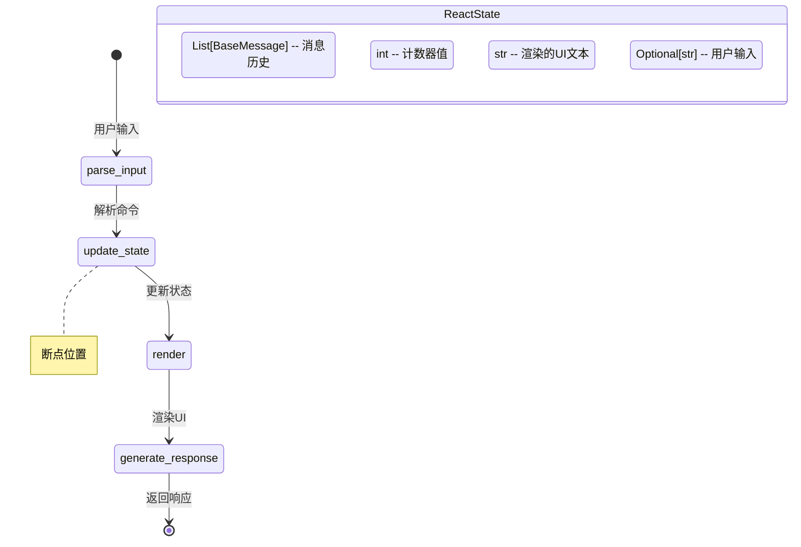
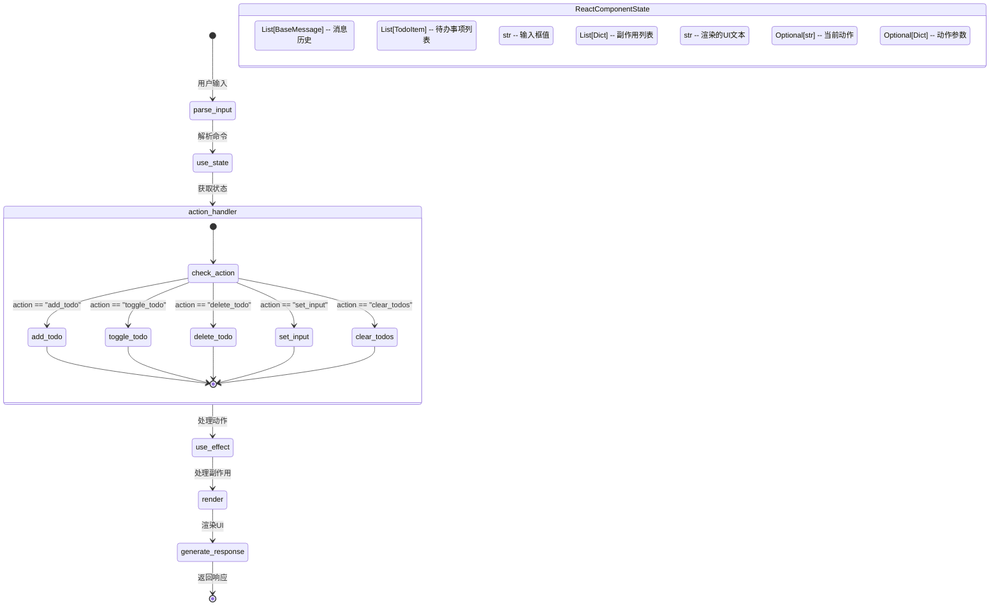
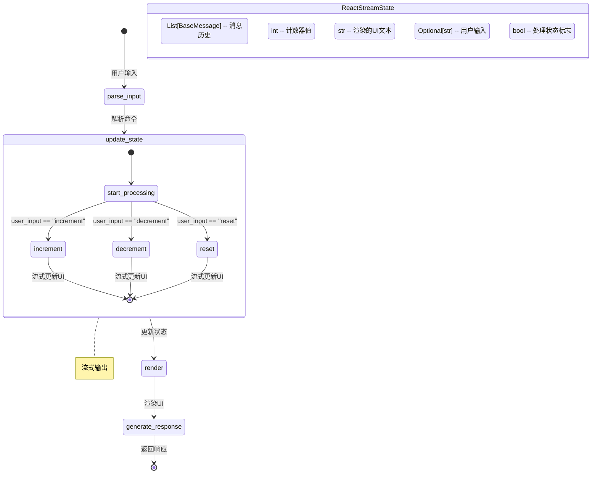
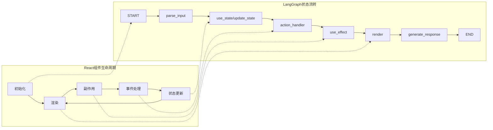
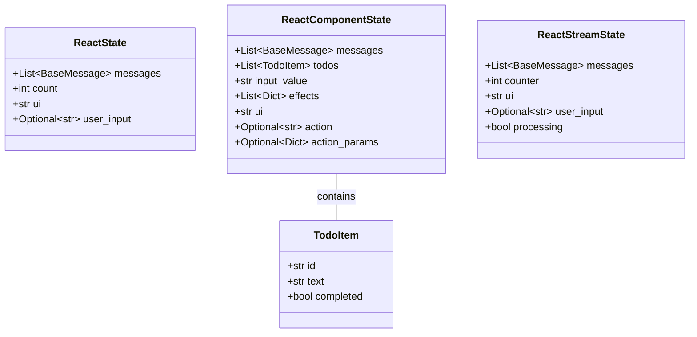
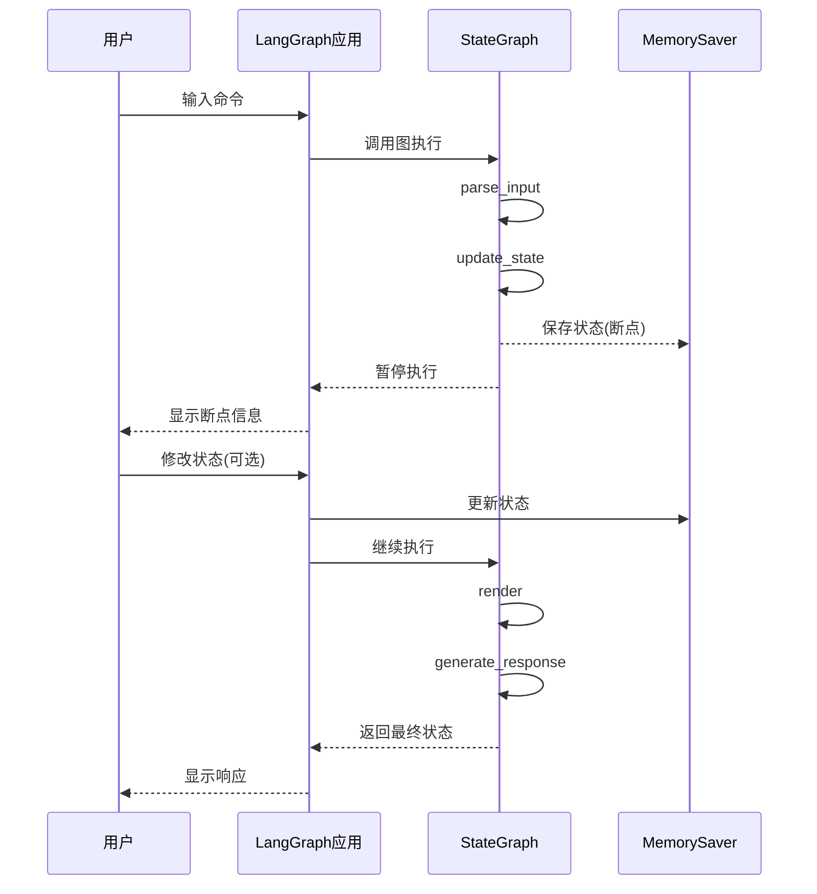
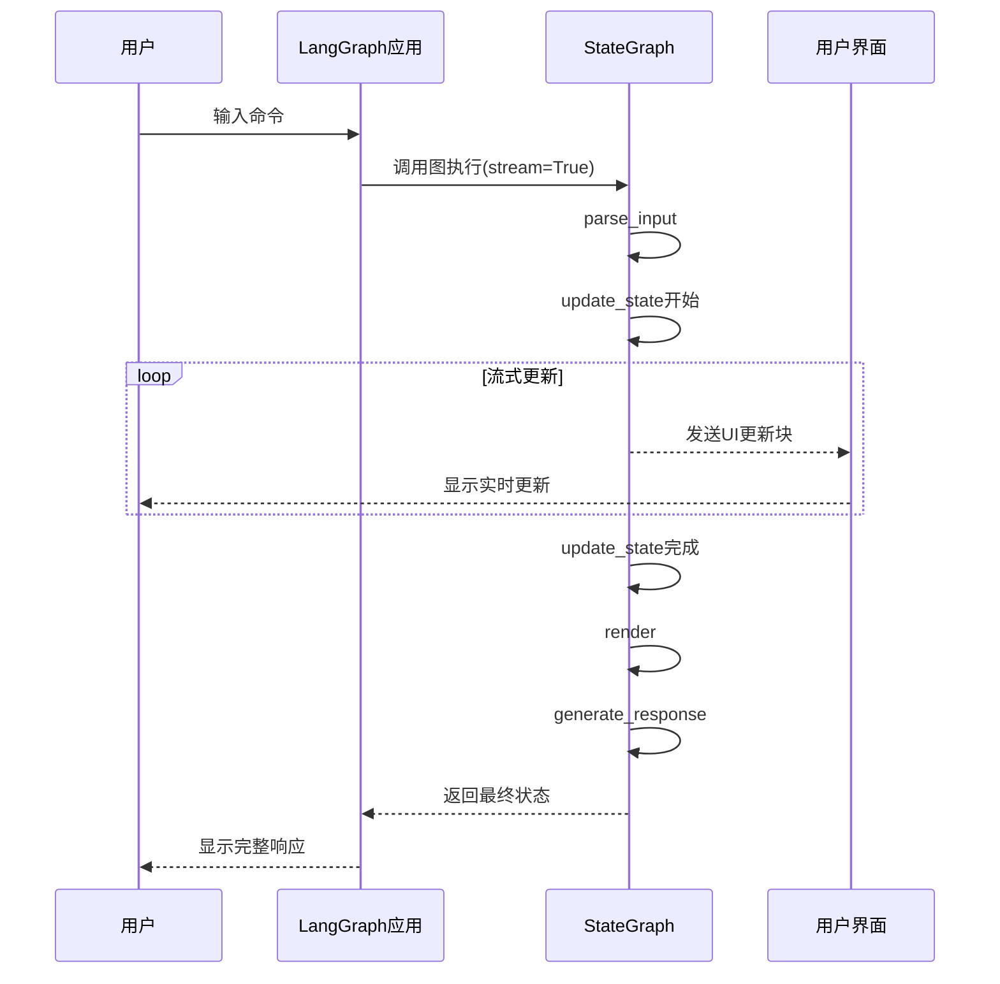

# LangGraph React风格应用示例

本项目展示了如何使用LangGraph构建模拟React组件生命周期的应用程序。通过这些示例，您可以了解如何将React的核心概念（如状态管理、组件渲染和副作用处理）应用到LangGraph框架中。

## 项目结构

项目包含三个主要示例：

1. **基础计数器应用** (`react_langgraph_breakpoint.py`) - 带断点调试功能的简单计数器
2. **待办事项应用** (`react_langgraph_todo.py`) - 更复杂的待办事项管理器，展示了更完整的React模式
3. **流式计数器应用** (`react_langgraph_streaming.py`) - 展示了如何实现流式UI更新的计数器

## 核心概念图解

### 基本状态流转图

所有示例都遵循类似的状态流转模式，模拟React的渲染循环：

### 待办事项应用流程图

待办事项应用实现了更完整的React模式，包括副作用处理：

### 流式处理应用流程图

流式处理应用展示了如何实现异步流式UI更新：

## 功能说明

### 1. 基础计数器应用 (带断点)

这个应用实现了一个简单的计数器，并展示了LangGraph的断点功能：

- **功能**：增加、减少和重置计数器
- **特色**：在`update_state`节点后设置断点，允许用户在执行过程中检查和修改状态
- **状态结构**：
  - `messages`: 消息历史
  - `count`: 计数器值
  - `ui`: 渲染的UI文本
  - `user_input`: 用户输入

### 2. 待办事项应用

这个应用实现了一个更复杂的待办事项管理器，展示了更完整的React模式：

- **功能**：添加、切换、删除和清空待办事项
- **特色**：实现了React的`useState`和`useEffect`钩子模式
- **状态结构**：
  - `messages`: 消息历史
  - `todos`: 待办事项列表
  - `input_value`: 输入框值
  - `effects`: 副作用列表
  - `ui`: 渲染的UI文本
  - `action`: 当前动作
  - `action_params`: 动作参数

### 3. 流式计数器应用

这个应用展示了如何实现流式UI更新：

- **功能**：增加、减少和重置计数器，带有动画效果
- **特色**：使用异步迭代器实现流式UI更新，模拟处理过程中的状态变化
- **状态结构**：
  - `messages`: 消息历史
  - `counter`: 计数器值
  - `ui`: 渲染的UI文本
  - `user_input`: 用户输入
  - `processing`: 处理状态标志

## 设计思想

### React模式在LangGraph中的应用

这些示例展示了如何在LangGraph中实现React的核心设计理念：

1. **状态隔离**：每个组件维护自己的状态，通过TypedDict定义状态结构

2. **单向数据流**：数据沿着图的边单向流动，从输入解析到状态更新，再到渲染和响应生成

3. **声明式UI**：UI是状态的函数，通过`render`函数将当前状态转换为UI表示

4. **副作用处理**：使用类似React的`useEffect`模式处理副作用，如日志记录和数据持久化

5. **组件生命周期**：通过图的节点和边模拟React组件的生命周期，从状态初始化到渲染和更新

### LangGraph与React模式对比图

### LangGraph特性的应用

这些示例还展示了LangGraph的一些关键特性：

1. **状态图**：使用`StateGraph`定义应用的状态转换逻辑

2. **断点调试**：在`react_langgraph_breakpoint.py`中展示了如何使用断点暂停执行并检查/修改状态

3. **流式处理**：在`react_langgraph_streaming.py`中展示了如何使用异步迭代器实现流式UI更新

4. **状态持久化**：使用`MemorySaver`实现状态的持久化和恢复

### 状态管理详细图

### 断点调试流程图

### 流式处理详细图

## 总结

这些示例展示了如何将React的设计理念应用到LangGraph框架中，创建具有清晰状态管理和UI渲染逻辑的应用程序。通过模拟React的组件生命周期和状态管理模式，这些示例提供了一种结构化的方法来构建复杂的LangGraph应用。

无论您是想构建简单的计数器还是复杂的待办事项管理器，这些示例都提供了可扩展的模式，可以应用于各种LangGraph应用场景。# langgraph-learn

