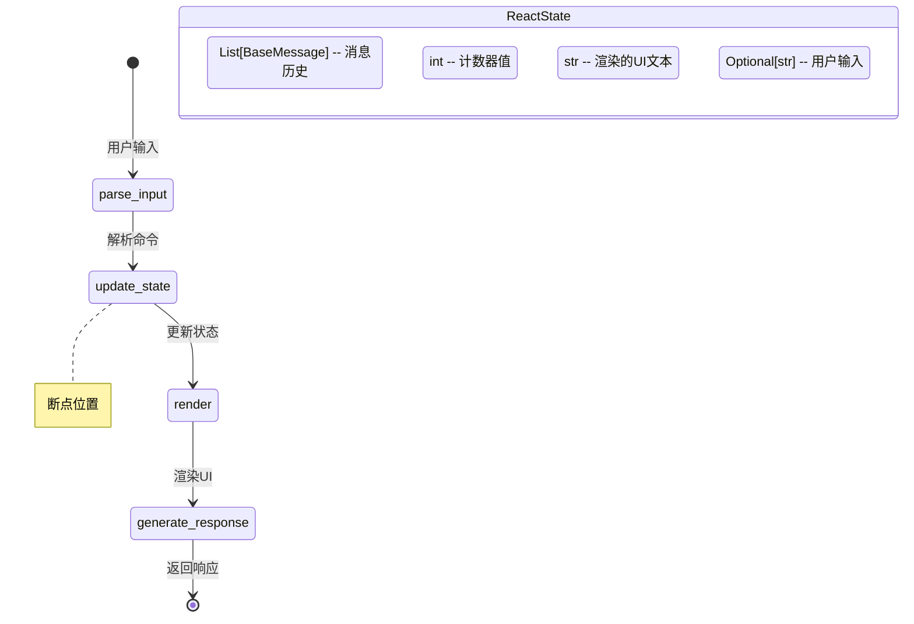
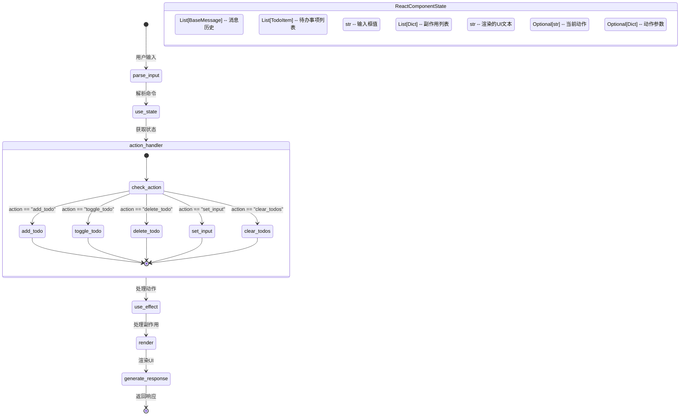
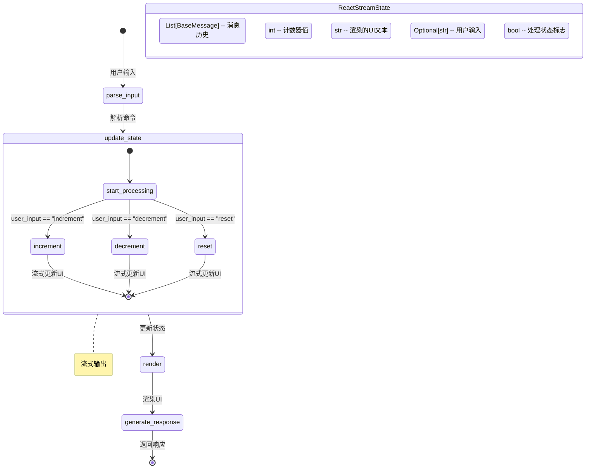
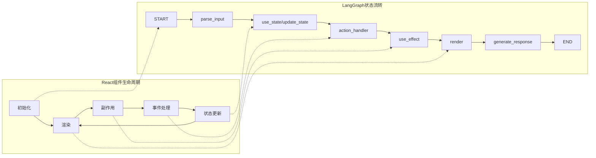
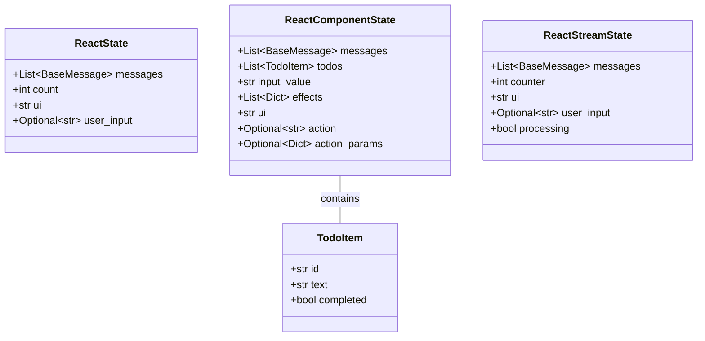
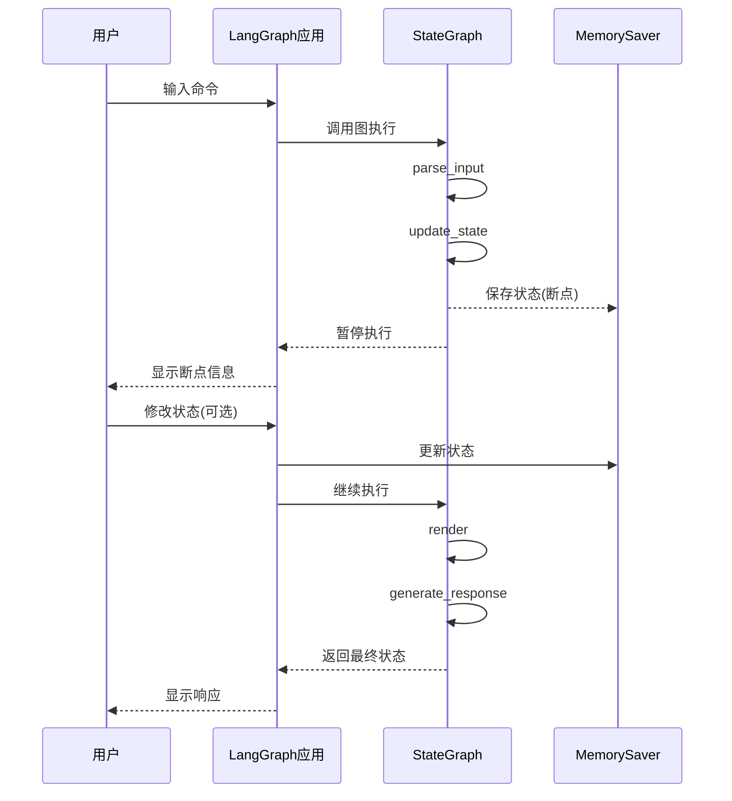
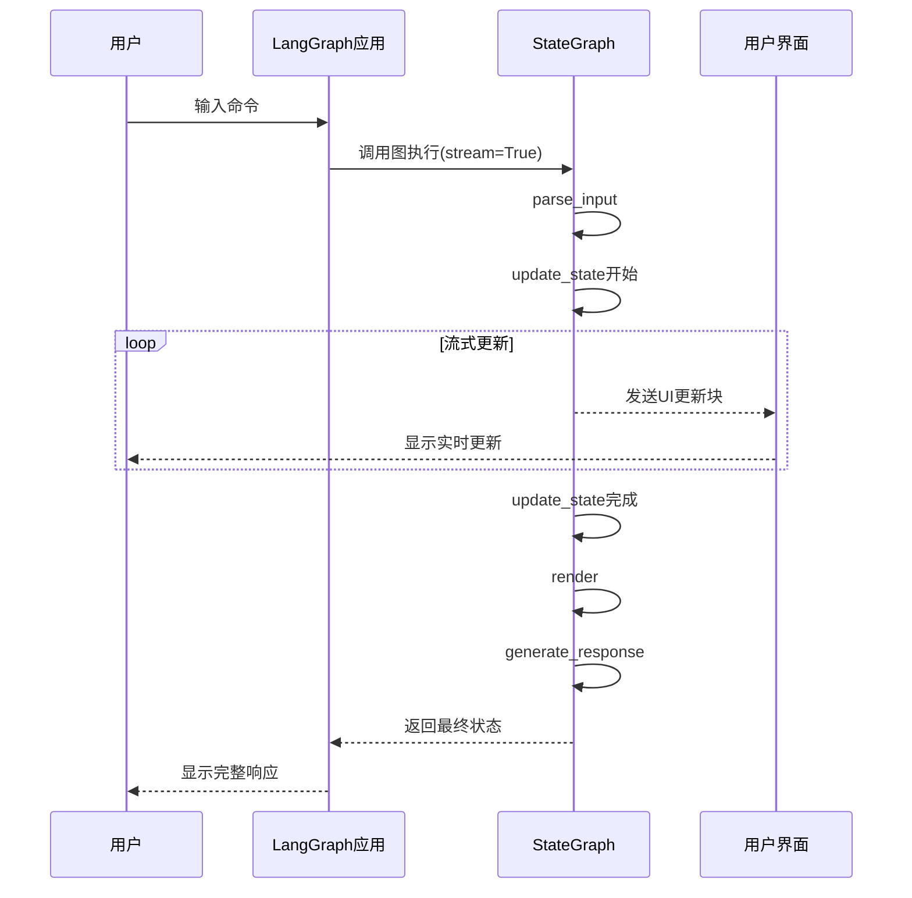

# LangGraph React风格应用图表

本文件包含使用Mermaid语法创建的图表，用于可视化LangGraph React风格应用的节点、边和状态流转关系。

## 基础计数器应用流程图

```mermaid
stateDiagram-v2
    [*] --> parse_input: 用户输入
    parse_input --> update_state: 解析命令
    update_state --> render: 更新状态
    note right of update_state: 断点位置
    render --> generate_response: 渲染UI
    generate_response --> [*]: 返回响应
    
    %% 状态定义
    state "ReactState" as state_def {
        messages: List[BaseMessage] -- 消息历史
        count: int -- 计数器值
        ui: str -- 渲染的UI文本
        user_input: Optional[str] -- 用户输入
    }
```

## 待办事项应用流程图

```mermaid
stateDiagram-v2
    [*] --> parse_input: 用户输入
    parse_input --> use_state: 解析命令
    use_state --> action_handler: 获取状态
    action_handler --> use_effect: 处理动作
    use_effect --> render: 处理副作用
    render --> generate_response: 渲染UI
    generate_response --> [*]: 返回响应
    
    %% 状态定义
    state "ReactComponentState" as state_def {
        messages: List[BaseMessage] -- 消息历史
        todos: List[TodoItem] -- 待办事项列表
        input_value: str -- 输入框值
        effects: List[Dict] -- 副作用列表
        ui: str -- 渲染的UI文本
        action: Optional[str] -- 当前动作
        action_params: Optional[Dict] -- 动作参数
    }
    
    %% 动作处理流程
    state action_handler {
        [*] --> check_action
        check_action --> add_todo: action == "add_todo"
        check_action --> toggle_todo: action == "toggle_todo"
        check_action --> delete_todo: action == "delete_todo"
        check_action --> set_input: action == "set_input"
        check_action --> clear_todos: action == "clear_todos"
        add_todo --> [*]
        toggle_todo --> [*]
        delete_todo --> [*]
        set_input --> [*]
        clear_todos --> [*]
    }
```

## 流式计数器应用流程图

```mermaid
stateDiagram-v2
    [*] --> parse_input: 用户输入
    parse_input --> update_state: 解析命令
    update_state --> render: 更新状态
    note right of update_state: 流式输出
    render --> generate_response: 渲染UI
    generate_response --> [*]: 返回响应
    
    %% 状态定义
    state "ReactStreamState" as state_def {
        messages: List[BaseMessage] -- 消息历史
        counter: int -- 计数器值
        ui: str -- 渲染的UI文本
        user_input: Optional[str] -- 用户输入
        processing: bool -- 处理状态标志
    }
    
    %% 流式处理详情
    state update_state {
        [*] --> start_processing
        start_processing --> increment: user_input == "increment"
        start_processing --> decrement: user_input == "decrement"
        start_processing --> reset: user_input == "reset"
        increment --> [*]: 流式更新UI
        decrement --> [*]: 流式更新UI
        reset --> [*]: 流式更新UI
    }
```

## LangGraph与React模式对比图

```mermaid
graph LR
    subgraph "React组件生命周期"
        R_Init["初始化"] --> R_Render["渲染"] 
        R_Render --> R_Effect["副作用"]
        R_Effect --> R_Event["事件处理"]
        R_Event --> R_State["状态更新"]
        R_State --> R_Render
    end
    
    subgraph "LangGraph状态流转"
        L_Start["START"] --> L_Parse["parse_input"]
        L_Parse --> L_State["use_state/update_state"]
        L_State --> L_Action["action_handler"]
        L_Action --> L_Effect["use_effect"]
        L_Effect --> L_Render["render"]
        L_Render --> L_Response["generate_response"]
        L_Response --> L_End["END"]
    end
    
    %% 概念映射关系
    R_Init -.-> L_Start
    R_State -.-> L_State
    R_Event -.-> L_Action
    R_Effect -.-> L_Effect
    R_Render -.-> L_Render
```

## 状态管理详细图

```mermaid
classDiagram
    class ReactState {
        +List~BaseMessage~ messages
        +int count
        +str ui
        +Optional~str~ user_input
    }
    
    class ReactComponentState {
        +List~BaseMessage~ messages
        +List~TodoItem~ todos
        +str input_value
        +List~Dict~ effects
        +str ui
        +Optional~str~ action
        +Optional~Dict~ action_params
    }
    
    class ReactStreamState {
        +List~BaseMessage~ messages
        +int counter
        +str ui
        +Optional~str~ user_input
        +bool processing
    }
    
    class TodoItem {
        +str id
        +str text
        +bool completed
    }
    
    ReactComponentState -- TodoItem : contains
```

## 断点调试流程图

```mermaid
sequenceDiagram
    participant User as 用户
    participant App as LangGraph应用
    participant Graph as StateGraph
    participant Checkpointer as MemorySaver
    
    User->>App: 输入命令
    App->>Graph: 调用图执行
    Graph->>Graph: parse_input
    Graph->>Graph: update_state
    Graph-->>Checkpointer: 保存状态(断点)
    Graph-->>App: 暂停执行
    App-->>User: 显示断点信息
    User->>App: 修改状态(可选)
    App->>Checkpointer: 更新状态
    App->>Graph: 继续执行
    Graph->>Graph: render
    Graph->>Graph: generate_response
    Graph-->>App: 返回最终状态
    App-->>User: 显示响应
```

## 流式处理详细图

```mermaid
sequenceDiagram
    participant User as 用户
    participant App as LangGraph应用
    participant Graph as StateGraph
    participant UI as 用户界面
    
    User->>App: 输入命令
    App->>Graph: 调用图执行(stream=True)
    Graph->>Graph: parse_input
    Graph->>Graph: update_state开始
    loop 流式更新
        Graph-->>UI: 发送UI更新块
        UI-->>User: 显示实时更新
    end
    Graph->>Graph: update_state完成
    Graph->>Graph: render
    Graph->>Graph: generate_response
    Graph-->>App: 返回最终状态
    App-->>User: 显示完整响应
```