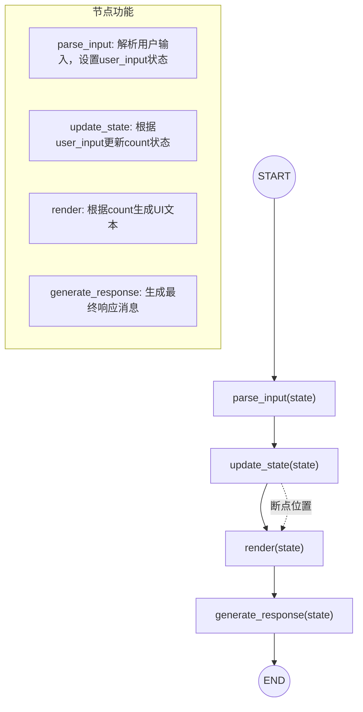
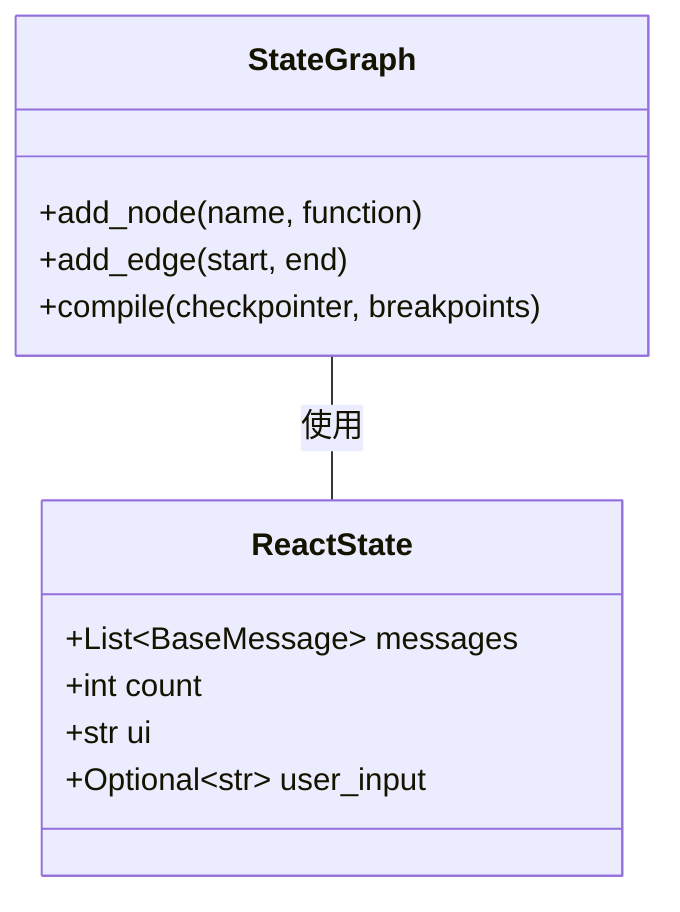
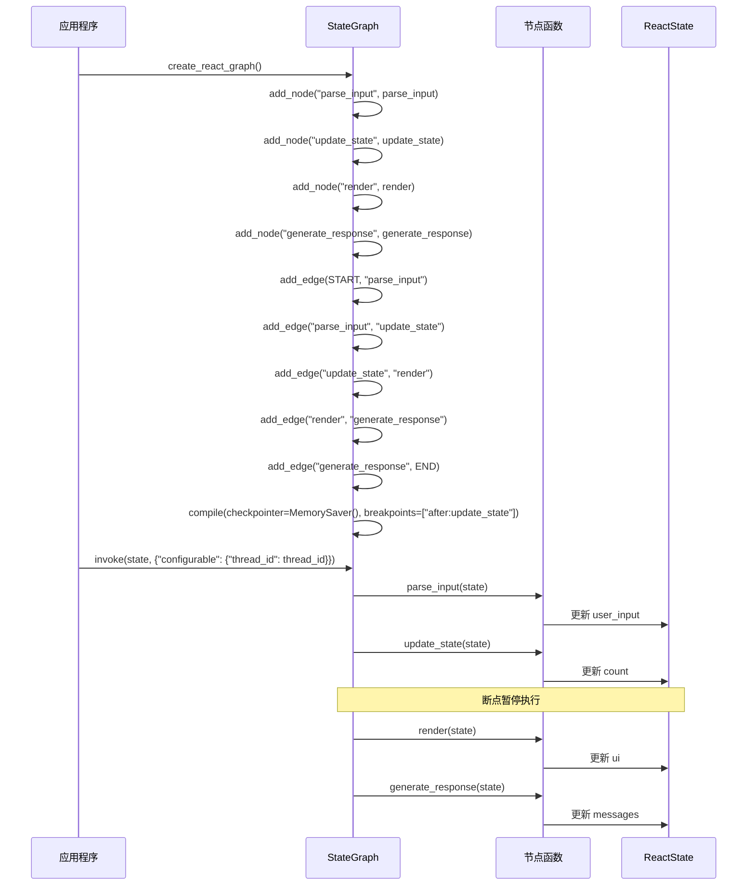
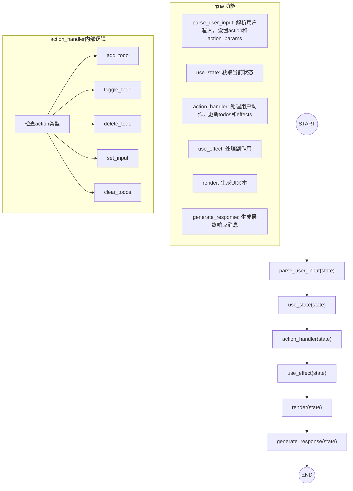
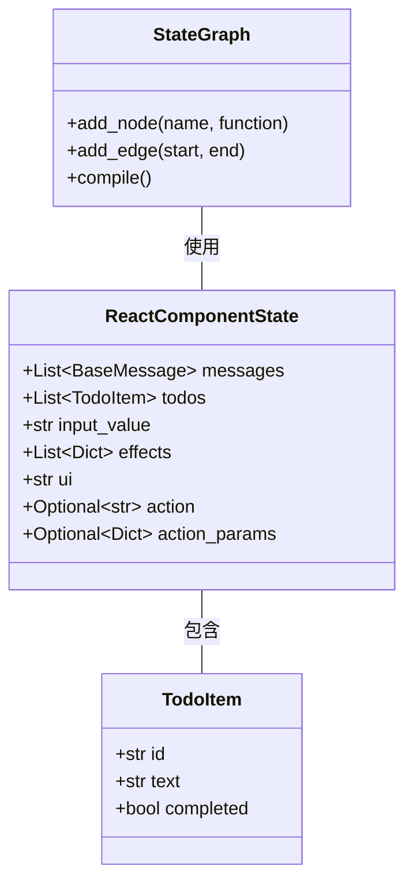
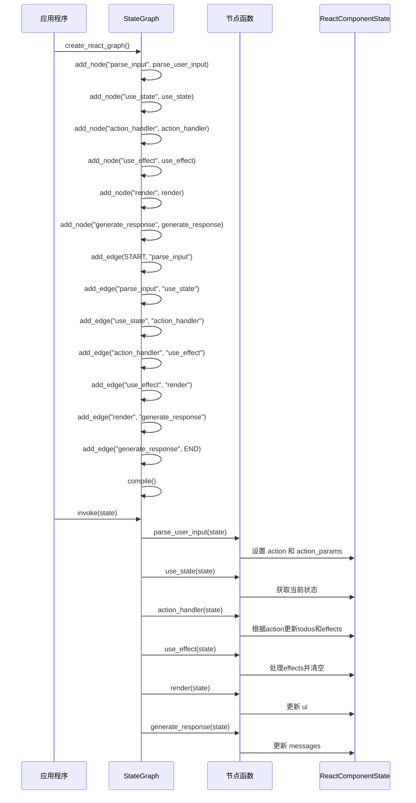
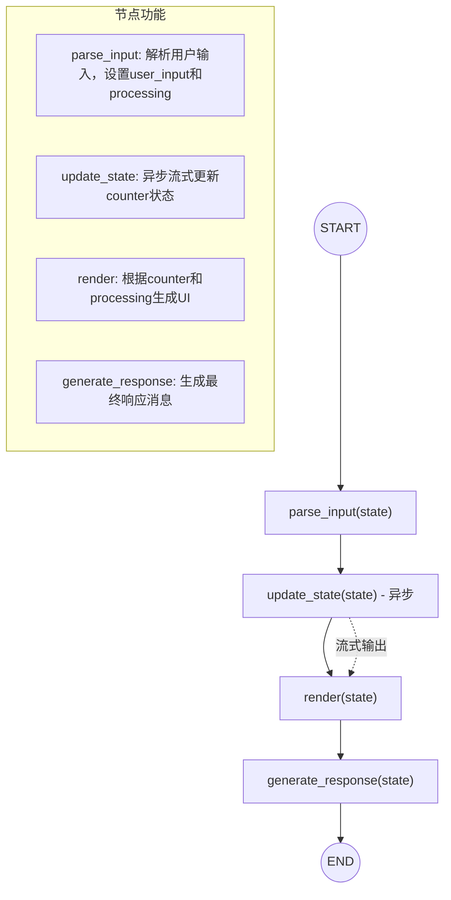
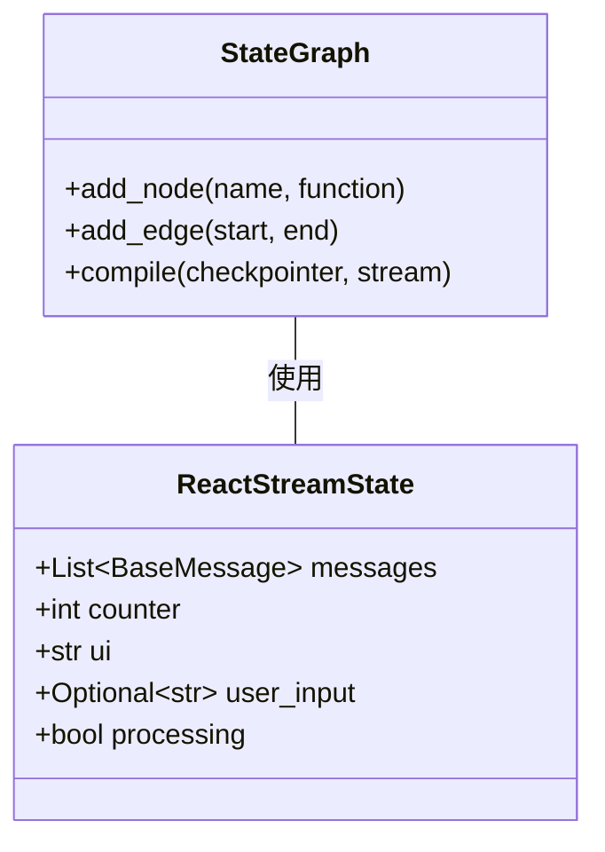
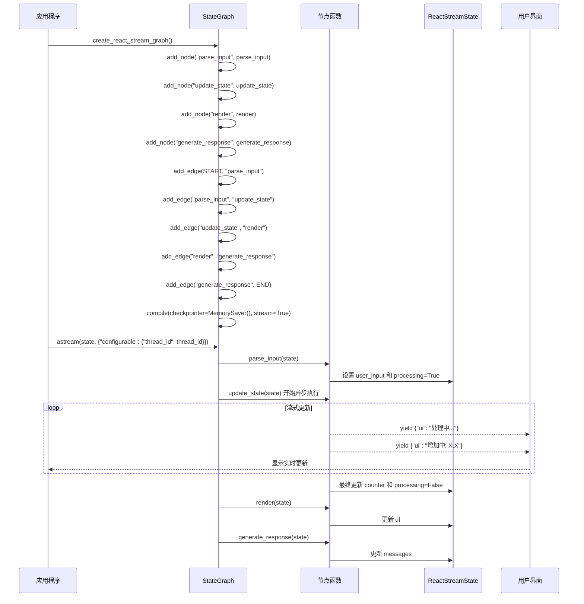
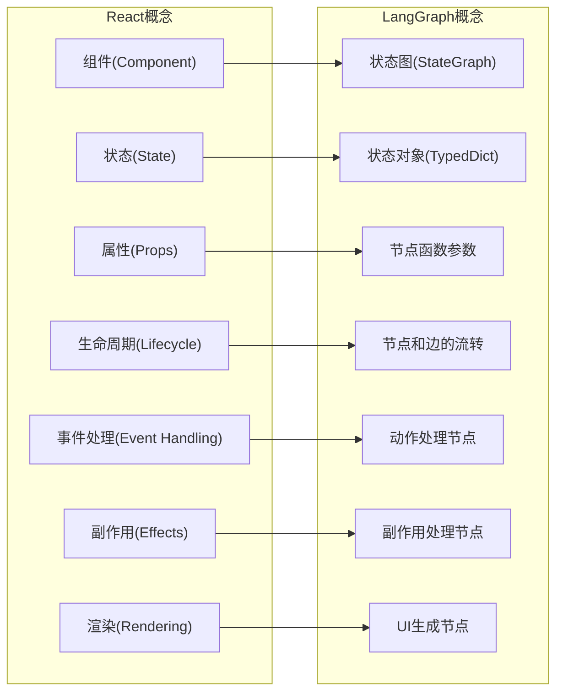

# LangGraph 代码架构详解

本文档详细展示了三个React风格应用中LangGraph的架构，清晰标识节点、边和状态流转关系，帮助理解代码结构。

## 1. 基础计数器应用 (react_langgraph_breakpoint.py)

### 节点和边的详细结构



### 状态对象结构



### 代码实现关键部分



## 2. 待办事项应用 (react_langgraph_todo.py)

### 节点和边的详细结构



### 状态对象结构



### 代码实现关键部分



## 3. 流式计数器应用 (react_langgraph_streaming.py)

### 节点和边的详细结构



### 状态对象结构



### 代码实现关键部分



## LangGraph与React概念对应关系



## LangGraph特性在代码中的应用

```mermaid
graph TD
    subgraph "LangGraph核心特性"
        F1["状态图(StateGraph)"] 
        F2["节点(Nodes)"] 
        F3["边(Edges)"] 
        F4["状态类型(TypedDict)"] 
        F5["断点调试(Breakpoints)"] 
        F6["流式处理(Streaming)"] 
        F7["状态持久化(MemorySaver)"] 
    end
    
    subgraph "代码实现"
        C1["graph = StateGraph(ReactState)"] 
        C2["graph.add_node(name, function)"] 
        C3["graph.add_edge(start, end)"] 
        C4["class ReactState(TypedDict)"] 
        C5["breakpoints=['after:update_state']"] 
        C6["stream=True"] 
        C7["checkpointer = MemorySaver()"] 
    end
    
    %% 映射关系
    F1 --> C1
    F2 --> C2
    F3 --> C3
    F4 --> C4
    F5 --> C5
    F6